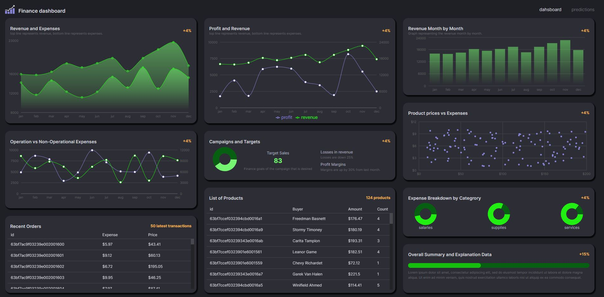
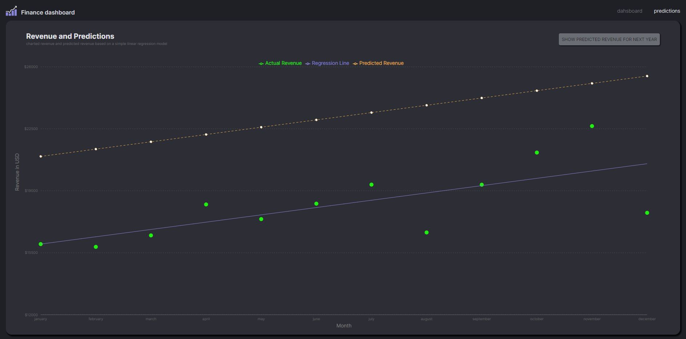

# finance-dashboard
Finance dashboard fullstack (MERN) app with redux-toolkit state management, written in React (Vite) and TypeScript. Frontend written in Vite, Redux-Toolkit, MUI (styles and components) and Recharts library (charts). Backend in Node.js, Express.js and MongoDB for database.

## 📦 Tech stack:
### Frontend
- React.js / Vite
- TypeScript
- Redux-toolkit
- MUI
- Recharts

### Backend
- Node.js
- Express.js
- Mongodb

## 💻 Demo
Click the link and check the app: [Link](https://ms-finance-dashboard.vercel.app/)

### Screenshot

## 💾 Installation
git clone https://github.com/marcinsuski/finance-dashboard.git

## /server: 
`cd server`  
`npm install`  
`npm run dev`  

## /client:
`cd client`  
`npm install`  
`npm run dev`  

## Environment variables:
After creating your own MongoDB database, add .env file to `server` directory and to add following data of your own:
MONGODB_URL="mongodb+srv://<your-username>:<your-password>.7km6ofs.mongodb.net/<your-database-name>?retryWrites=true&w=majorityk"
PORT="port number, e.g 8080"

Sample data in /client/data/data.js for data structure reference.

## ☎️ Contact
In case of any comments or advice, You can e-mail me or use Issues :)

## 🧙‍♂️ Author
- GitHub - [Marcin Suski](https://github.com/marcinsuski)
- LinkedIn - [marcin-suski](https://www.linkedin.com/in/marcin-suski/)
- Porftolio - [marcinsuski.pl](https://marcinsuski.pl)
